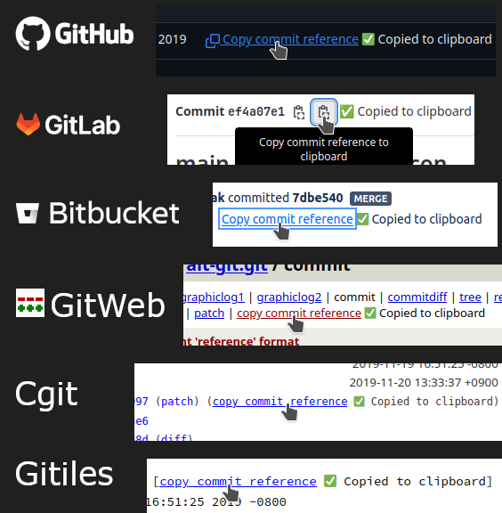

# Copy commit reference userscript

Adds a "Copy commit reference" link to commit pages of Git hosting providers.
An example of a reference is:

> The reference format in git.git repository has been implemented in commit
> [1f0fc1d](https://github.com/git/git/commit/1f0fc1db8599f87520494ca4f0e3c1b6fabdf997)
> (pretty: implement 'reference' format, 2019-11-20).

Such references are a good way of providing context in commit messages. The
userscript supports both plain text and HTML, with clickable links to the
website. This is useful in rich text editors, e.g. in Slack and visual mode of
Jira.

Install the userscript via [Greasy Fork][GreasyFork].

[![Badge showing number of installs from Greasy Fork][GreasyForkInstallsBadge]][GreasyFork]

The source code is distributed under the terms of the GNU Affero General Public
License, Version 3.  See [LICENSE.txt](LICENSE.txt) for details.

### Supported hosting providers

- [ GitWeb](https://git-scm.com/docs/gitweb), see also [chapter in "Pro Git" book](https://git-scm.com/book/en/v2/Git-on-the-Server-GitWeb)
- [Cgit](https://git.zx2c4.com/cgit/about/) – "A hyperfast web frontend for git repositories written in C."
- [ GitHub](https://github.com)
- [ GitLab](https://gitlab.com)
- [ Bitbucket Cloud](https://www.atlassian.com/software/bitbucket)
- [ Bitbucket Server](https://support.atlassian.com/bitbucket-server/)
- [Gitiles](https://gerrit.googlesource.com/gitiles/) – "A simple JGit repository browser"

### Demo

[GreasyForkInstallsBadge]: https://img.shields.io/badge/dynamic/json?style=flat&color=670000&label=Greasy%20Fork&query=total_installs&suffix=%20installs&url=https%3A%2F%2Fgreasyfork.org%2Fscripts%2F473195.json
[GreasyFork]: https://greasyfork.org/en/scripts/473195-git-copy-commit-reference
